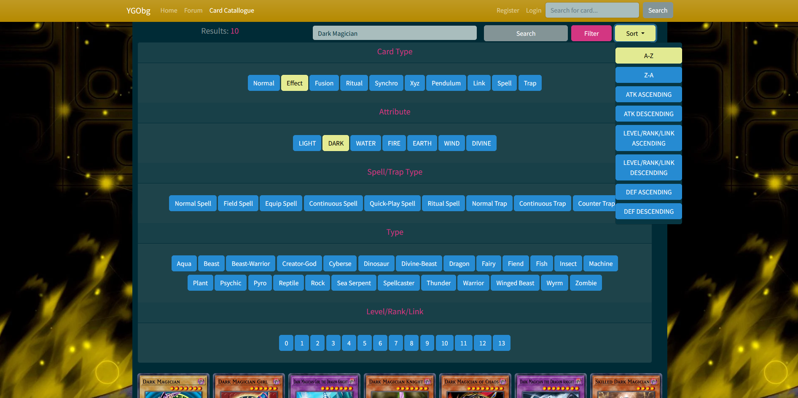
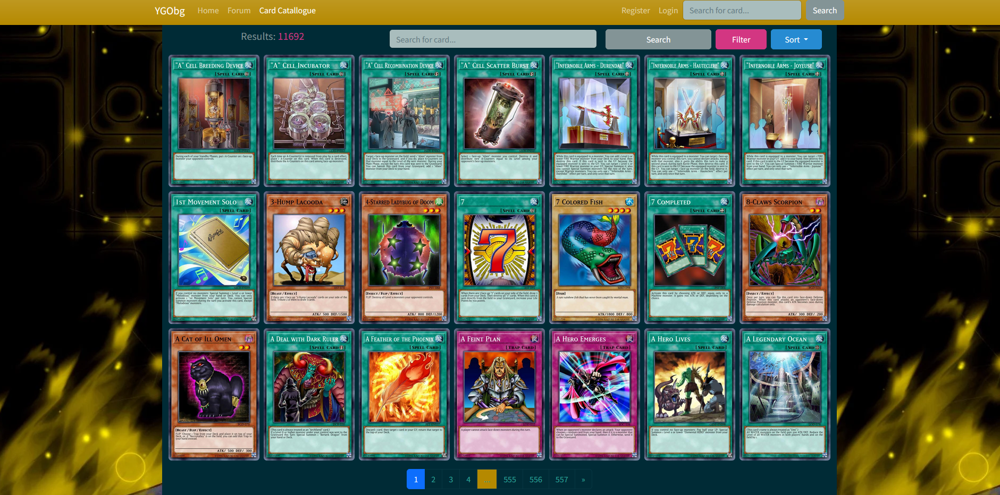
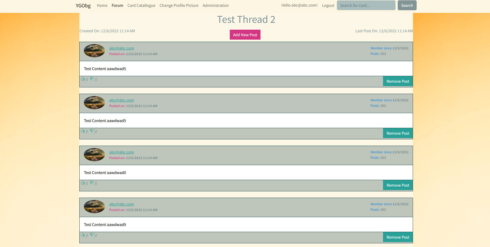
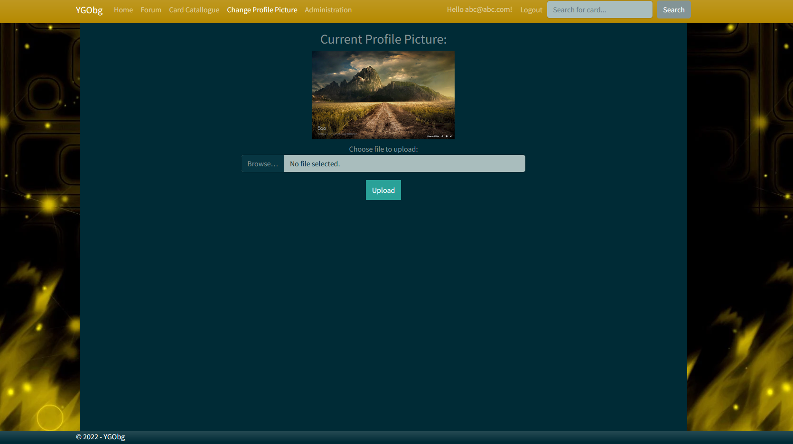
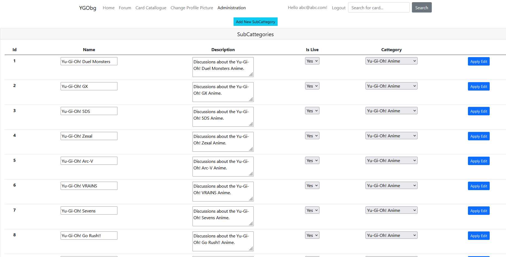
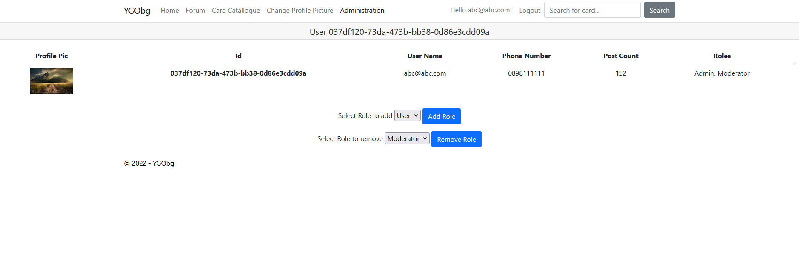

# Yu-Gi-Oh-website
My project for Softuni's Asp.NET Course - a Yu-Gi-Oh website consisting of a forum and a card catalogue. - https://ygobg.azurewebsites.net/
<h2>Technologies and Libraries used</h2>
<ul>
  <li>.Net 6</li>  
  <li>Entity Framework Core</li>
  <li>Sql Server</li>
  <li>MongoDb</li>
  <li>ASP.Net Core Identity</li>
  <li>Automapper</li>
  <li>Serilog</li>
  <li>NToastNotify</li>
  <li>Cloudinary</li>
  <li>tinyMce</li>
  <li>xUnit</li>
  <li>Moq</li>
</ul>

  The card catalogue is using data from the YGOPro public API - https://ygoprodeck.com/api-guide/
  
<h2>Images</h2>

